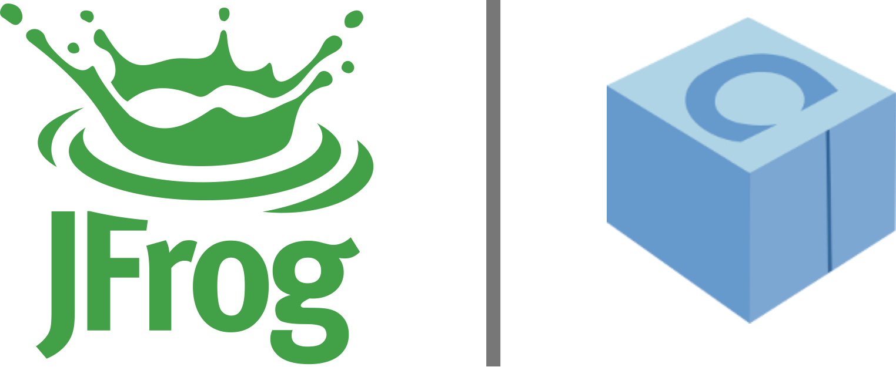

# Madrid C/C++ User Group
2018-06-14 - La Nave

## Contents:
- [Madrid C/C++ User Group](MadridCCppUG.pdf), Javier G. Sogo
- Trip report: Hawaii, José Daniel García
- Conan Quiz, Diego Rodríguez-Losada
- Introducción a Conan, Diego Rodríguez-Losada

### Related content: 

We are grateful to the sponsors of this meeting:  

  
