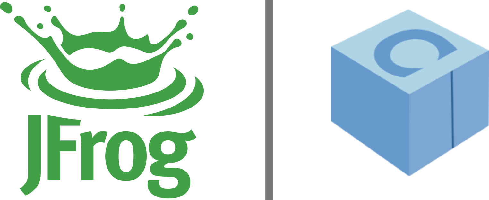

# No littering
2019-01-22 - Google for Startups

## Contents:
- [Our community](our_community.pdf) `[ES]`, Javier G. Sogo
- [Introducing Bjarne](intro_bjarne.pdf) `[EN]`, José Daniel García
- [No littering](no_littering.pdf) `[EN]`, Bjarne Stroustrup

### Related content:  

We are grateful to the sponsors of this meeting:  

