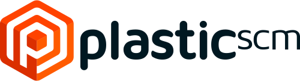

# Tooling: merge semántico para C++
2019-02-21 - Tuenti

## Contents:
- [Welcome](welcome.pdf) `[ES]`, Javier G. Sogo [&#x25b6;](https://youtu.be/Fc4mAI5cDUQ)
- [Merge semántico para C++](https://www.slideshare.net/MryamGmezSanMartn/c-meetup-madrid) `[ES]`, Míryam Gómez & Violeta Sánchez [&#x25b6;](https://youtu.be/)
- [JSON RPC with C++ static reflection](json_rpc.pdf) `[ES]`, Manu Sánchez [&#x25b6;](https://youtu.be/)

### Related content:  

We are grateful to the sponsors of this meeting:  

