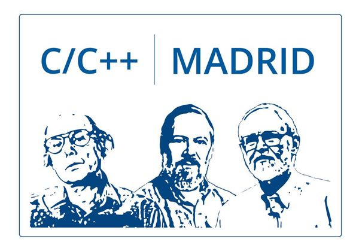

## C/C++ Madrid User Group

 

## Presentations and Materials

Slides, presentations and reference material from our meetings.  
Note that not all presentation slides are optimized for reading without the accompanying talk.

**2019**
- [Tooling: merge semántico para C++ (Tuenti)](2019-02-21_Tuenti_PlasticSCM) 21 feb 2019
- [No littering (Google for Startups)](2019-01-22_Google_Stroustrup) 22 ene 2019
- [Next generation unit testing &#124; Build deterministas (GO Madrid)](2019-10-22_GoMadrid_Next-generation-unit-testing) 22 oct 2019

**2018**
- [Bare metal programming (Indizen)](2018-12-13_Indizen_Bare-metal-programming) 13 dec 2018
- [MarketGoo ❤️ C++ (Liferay)](2018-11-22_Liferay_MarketGoo) 22 nov 2018
- [Hagamos bibliotecas fáciles de usar (Indizen)](2018-10-25_Indizen_Hagamos-bibliotecas-faciles-de-usar) 25 oct 2018
- [SaaI: Sublime as an IDE (IBM)](2018-09-27_IBM_SublimeTextIDE) 27 sept 2018
- [Calculate (Indizen)](2018-07-26_Indizen_Calculate) 26 jul 2018
- [Madrid C/C++ User Group (La Nave)](2018-06-14_LaNave_Comunidad) 14 jun 2018

## Find Us

- [Meetup](https://www.meetup.com/Madrid-C-Cpp/)
- [GitHub](https://github.com/madridccppug)
- [Slack](https://cpplang.slack.com/messages/C9TDZJWCC)
- [Twitter](https://twitter.com/madridccppug)

## Contact Us
- [Javier G. Sogo](mailto:jgsogo@gmail.com) :: [Twitter](https://twitter.com/jgsogo)
- Manu Sánchez :: [Twitter](https://twitter.com/Manu343726)

You can also check out our [Meetup page](https://www.meetup.com/es-ES/Madrid-C-Cpp/) or use [this form](https://madridcc.typeform.com/to/R7QcNa) to reach us!

## We Want Your Talk!
Madrid C/C++ User Group is build by and for the community, we need **you** to keep
the ball rolling. Talks, workshops, games,... any activity or format you could imagine
will be welcome, and we will do our best to organize it and help you.  

Hope to see you soon... at the stage!
